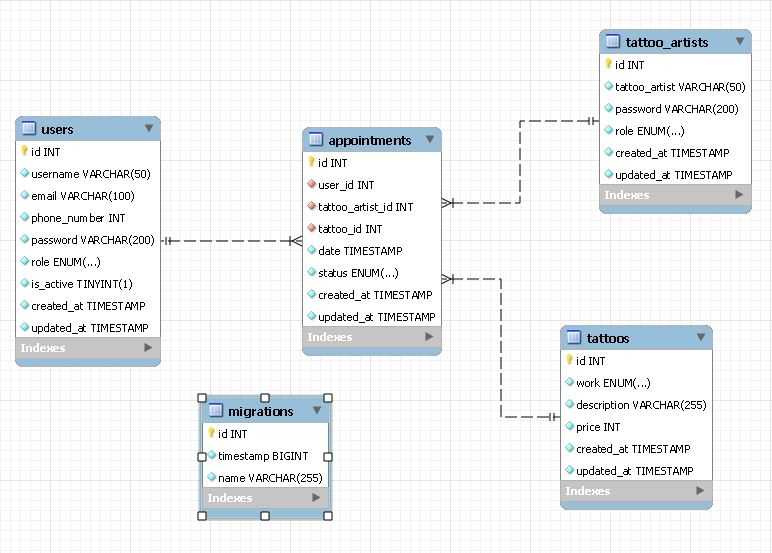

<h1 align="center"> BACKEND ROCKET TATTOO</h1>
​
​

Proyecto 4 - Bakend para estudio de tattoo

​

Proyecto de creacion de una api rest para un estudio de tatuajes.
 
Desarrollada como formacion del Bootcamp de Full Stack Developer de Geekshubs Academy.

​
​

​
​
<h5 align="center"> Tecnologías utilizadas</h1>
​

TypoScript, node, express, typeOrm, openAI, git/github y Postman/ThunderClient

  <tr >
    <td valign="top"></td>
    <td valign="top"></td>
    <td valign="top"></td>
    <td></td>
     <td valign="top"></td>
    <td valign="top"></td>
    <td valign="top"></td>
    <td valign="top"></td>

​

## Tabla de contenidos

​

- [👩🏻‍💻 Descripción del proyecto]
- [🔍 Observaciones]
- [⚖️ Licencia y Copyright]

  ​
  ​

### Descripción

​
Tercer proyecto creado durante la semana 7 y 8 del bootcamp. Creacion de un backend y una API REST para un estudio de tatuajes, centrado en aprender a manejar tablas, migraciones, endpoints...

## Esquema de la BBDD:

## Como utilizar la API:

**Instalar node**  
**instalar express**  
**instalar typeORM**  
**instalar postman o la extension de VSCODE Thunderclient**  
**instalar dotenv**  

#### SCRIPTS EN EL PACKAGE JSON

"dev": "nodemon ./src/index.ts",  
    "build": "tsc",  
    "start": "node ./build/index.js"

ejecutar el comando **npm run dev** en el terminal

Lo primero crear un usuario y hardcodearlo en la BBDD directamnte con el role **super_admin**.

Esto nos permitira en un futuro poder dar de alta a los tatuadores y tener acceso a ciertos endpoints, ya que no vamos a permitir que todos los usuarios ya sean users o tatuadores tengan acceso a toda la informacion.

el email de los usuarios siempre va a ser **nombre@nombre.com**
la contraseña siempre es el **Nombre4$**

##### Endpoints:

###### Endpoints para user:

localhost:4004/user

> /register TIPO: **POST** : crear usuarios
>
> > AUTH: nada  
> > BODY
> >
> > > {  
> > > "username":"your name",  
> > > "email":"your email",  
> > > "password":"your password",  
> > > "phone_number":"your phone"  
> > > }

> /login TIPO: **POST**: logear usuarios
>
> > AUTH: nada  
> > BODY
> >
> > > {  
> > > “Email”:”your email” 
> > > “Password:”your password” 
> > > }

> /profile TIPO: **GET**: obtener tu perfil de usuario
>
> > AUTH: token tipo bearer obtenido al hacer el login  
> > BODY: nada

> /update TIPO: **PUT**: modificar usuarios
>
> > AUTH: token tipo bearer obtenido al hacer el login  
> > BODY
> >
> > > 
> > > {  
> > > "username":"your name",  
> > > "email":"your mail",  
> > > "password":"your password",  
> > > "phone_number":"your phone"  
> > > }

> /myAppointments TIPO: **GET**: ver tus citas como usuario
>
> > AUTH: token tipo bearer obtenido al hacer el login  
> > BODY: nada

> /all TIPO: **GET**: ver todos los usuarios por el role minimo de admin
>
> > AUTH: token tipo bearer  obtenido al hacer el login  
> > BODY: nada

> /delete TIPO: **DELETE**: eliminar un usuario por el super admin
>
> > AUTH: token tipo bearer de un role minimo de Admin obtenido al hacer el login  
> > BODY: 
> >
> > >{
> > >  "id": "user id to eliminate" 
> > >}

> /role TIPO: **PUT**: cambiar role de un usuario por el super admin
>
> > AUTH: token tipo bearer de un role de super admin obtenido al hacer el login  
> > BODY: 
> >
> > >{
> > >  "id": "user id"
> > >  "role": "admin" or "super_admin" 
> > >}

###### Endpoints para appointments:

localhost:4004/appointments

> /create TIPO: **POST** : crear citas
>
> > AUTH: token tipo bearer obtenido al hacer el login  
> > BODY
> >
> > > {  
> > >  "tattoo_artist_id": tattoo_artistid  
> > >  "tattoo_id":tattoo id,   
> > >  "date":"YYYY/MM/DD HH:MM:SS"
> > > }

> /update TIPO: **PUT** : actualizar citas
>
> > AUTH: token tipo bearer obtenido al hacer el login  
> > BODY
> >
> > > { 
> > > "id": appointment_id,
> > > "tattoo_artist_id": tattoo_artist id,  
> > > "tattoo_id":tattoo id,   
> > > "date":"YYYY/MM/DD HH:MM:SS"  
> > > }

> /delete TIPO: **DELETE** : eliminar citas
>
> > AUTH: token tipo bearer obtenido al hacer el login  
> > BODY
> >
> > > {  
> > >  “Id”:appointment_id  
> > > }

###### Endpoints para tattoo_artist:

localhost:4004/artist

> /register TIPO: **POST** : crear nuevos tatuadores
>
> > AUTH: token tipo bearer obtenido al hacer el login, solo sirve el de super admin.  
> > BODY
> >
> > > {  
> > > "tattoo_artist":"tatto artists name",  
> > > "password":"your password"
> > > }

> /login TIPO: **POST** : login para tatuadores
>
> > AUTH: nada  
> > BODY
> >
> > > {  
> > > "tattoo_artist":"tatto artists name",  
> > > "password":"your password"
> > > }

> /myAppointments TIPO: **GET** : ver tus citas como tatuador
>
> > AUTH: token tipo bearer obtenido al hacer el login, solo sirve el de level admin o super admin 
> > BODY: nada

> /all TIPO: **GET** : ver a todos los tatuadores
> >
> > AUTH: token tipo bearer obtenido al hacer el login  
> > BODY: nada

###### Endpoints para works:

localhost:4004/tattoo

> /create TIPO: **POST** : crear works
>
> > AUTH: token tipo bearer obtenido al hacer el login, solo sirve el de level admin o super admin  
> > BODY
> >
> > > {  
> > >  "twork": ENUM "tattoo" or "piercing",   
> > >  "description": "work description",   
> > >  "price": price
> > > }

> /update TIPO: **PUT** : actualizar work
>
> > AUTH: token tipo bearer obtenido al hacer el login, solo sirve el de level admin o super admin   
> > BODY
> >
> > > { 
> > > "id": tattoo_id,
> > > "work": work_id,  
> > > "description": "work description",   
> > > "price": price  
> > > }

> /delete TIPO: **DELETE** : Eliminar un tatuaje
>
> > AUTH: token tipo bearer obtenido al hacer el login, solo sirve el de level admin o super admin  
> > BODY: 
> >
> > > {  
> > >  "id": tattoo_id,  
> > > }

### Cambios pendientes

- Mejorar el validador para la fecha de la cita, teniendo en cuenta el tiempo para realizar el trabajo.
- Podiramos hacer mas endpoints, le dariamos mas funcionalidad.
- Mejorar la logica de los endpoint para maximizar el rendimiento.
- Añadir validaciones

### Agradecimientos

A los profesores de GeekHubs y a los compañeros del bootcamp.
​
​

### Licencia y copyright

📝 La licencia utilizada es una MIT License.
